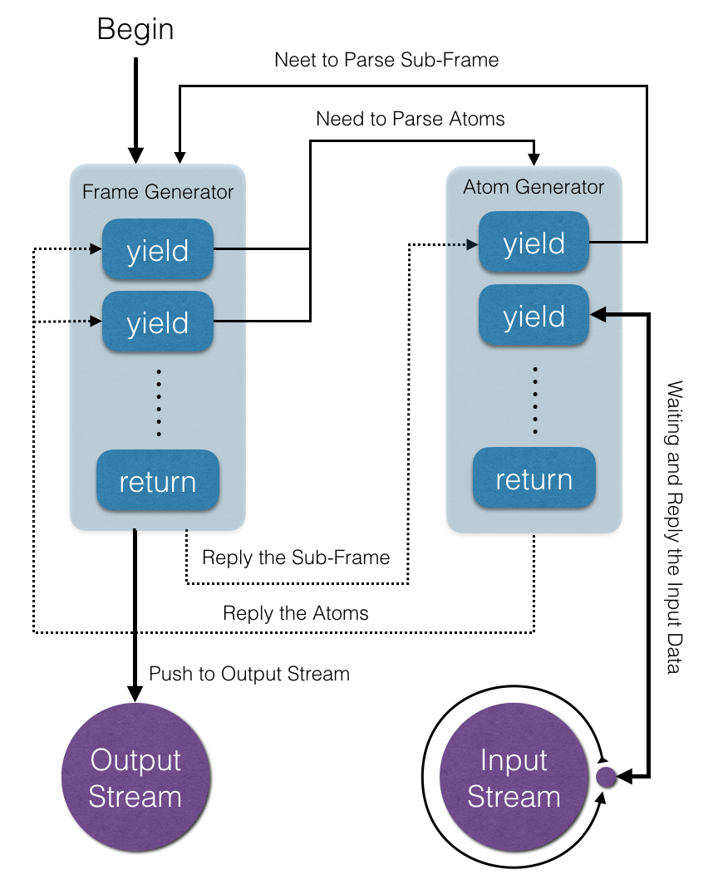

## FrameGenerator

Transform Binary Stream to Object Stream through Generator

It's suitable for parsing protocol from binary stream

### Require

node > 6

### Usage

##### new FrameGenerator(generator);

The `FrameGenerator` is inherited from `Stream.Transform`.

`generator` is a Generator Function, that describes a format of frame.

In the `generator`, following usages are defined:

1. `yield number` read a known lenght buffer.
2. `yield string` read buffer until the string occured.
3. `yield iterator` parse asynchronously a sub-frme.
4. `yield array` read buffer until any one string occured.
5. `return any` return a value as the frame data.

### Demo

```js
const FrameGenerator = require('FrameGenerator');

let fg = new FrameGenerator(function*() {
  let buffer1 = yield length;
  let buffer2 = yield terminator;
  let buffer3 = yield subFrame();
  let [ buffer4, strx ] = yield [ str1, str2 ];
  return { buffer1, buffer2, buffer3, buffer4 };
});

inputStream.pipe(fg).pipe(outputStream)
```

### Chematic Diagram


